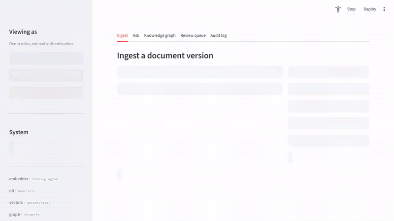

# Self-Updating Knowledge Agent

[](https://github.com/waniaaijaz/self-updating-knowledge-agent/actions/workflows/tests.yml)
[](LICENSE)

A RAG pipeline that notices when a new document version contradicts an old
one, instead of just dumping both into the same vector index. When a chunk
from a new version conflicts with an existing chunk, the old one gets marked
`SUPERSEDED` and a `SUPERSEDES` edge is recorded in a small knowledge graph.
At query time, superseded chunks are excluded before ranking.

Runs entirely locally with no signups required. Free cloud tiers (Qdrant
Cloud, Neo4j AuraDB, Gemini) can be swapped in through env vars if you want.

## Demo



Part 1 shows version-aware retrieval (v2 supersedes v1, the old clause is
filtered out). Part 2 shows permission-aware retrieval (an HR-only clause is
hidden from an employee and shown to hr, and both queries end up in the
audit log). The documents are fictional and the demo is scripted with
Playwright. Answers are generated by Gemini (`gemini-3.6-flash`, shown as the
generator label under each answer). Embeddings and conflict detection use the
offline backends. Time spent waiting for Gemini is cut from the video, and a
caption says so. To regenerate it, put `GEMINI_API_KEY` in `.env`, then
`pip install -r demo/requirements-demo.txt && playwright install chromium`, and
`python demo/record_demo.py && python demo/build_video.py`.

## Why

A plain vector store ranks purely by similarity. If you load HR Policy v1
(2024) and HR Policy v2 (2026) into the same index and ask about the home
office stipend, you get both of these back:

> v1 — "Remote employees receive an annual home office stipend of $500."
> v2 — "The annual home office stipend is suspended effective Q1 2026."

Both are semantically close to the question, so both come back, and the LLM
either picks one arbitrarily or blends them into something that isn't
actually policy. Just filtering by recency doesn't work either, because most
of a document doesn't change between versions — the 2024 sick-leave rule is
still valid and still needs to be retrievable. You need supersession at the
clause level, not the document level.

## How it works

Ingestion isn't a plain write — each incoming chunk goes through a small
pipeline:

```
incoming chunk
     |
     v
+--------------+
|  dedup gate  |  SHA-256 on normalised text ---- duplicate ---> skip
+------+-------+  (skips most chunks in a versioned doc -- only the
       v           changed ones make it past here)
+--------------+
|   retrieve   |  top-k semantic neighbours, same doc_id, earlier versions
+------+-------+
       v
+--------------+
|  NLI check   |  cross-encoder, checked in both directions
+------+-------+
       |
   +---+----------------+---------------------+
   v                    v                     v
score >= 0.88       0.50 - 0.87            below 0.50
supersede          human review            clean insert
   |                    |
   |                    +-> old chunk stays ACTIVE until someone reviews it
   v
old chunk marked SUPERSEDED, freshness -> 0
new (v2)-[:SUPERSEDES {nli_score, detected_at}]->(v1)
```

At query time, superseded chunks are filtered out before ranking, so the LLM
never even sees the outdated version.

## Some of the less obvious decisions

**Supersession only happens through an explicit edge, not by age.** An old
but never-contradicted clause is still policy. Freshness (`e^(-lambda*dt)`,
half life configurable, default ~3 years) only affects ranking order, with a
floor so old-but-valid content doesn't disappear from retrieval entirely.
The only thing that removes a chunk is a `SUPERSEDES` edge the pipeline
actually wrote.

**Auto-supersede threshold sits above the point that maximizes F1.** False
positives and false negatives aren't equally bad here -- silently marking a
still-valid rule as superseded is worse than leaving a stale chunk around a
bit longer (a human is more likely to catch the second one). So the
threshold is deliberately conservative, and anything in the grey zone goes
to a review queue rather than getting auto-resolved either way.

**NLI scores are softmaxed, and checked both directions.** `CrossEncoder.predict`
gives back raw logits for the NLI head, not probabilities -- using argmax on
the raw values gives numbers that blow way past any sane threshold. See the
comment at the top of `src/nli.py` for the rest of the details I ran into
here (label ordering per checkpoint, directionality).

**Chunking follows markdown headers, not a fixed window.** A version bump
usually rewrites one clause and leaves the rest alone. Fixed-size chunking
can split a clause across a boundary and make the contradiction invisible.
Chunks here are split on headers, each one keeps its header path (e.g. `HR
Policy 2026 > 3 Compensation > 3.1 Home Office Stipend`) so it's readable on
its own, and a doc with no headers falls back to one chunk rather than being
dropped.

## Access control

Retrieval is also permission-aware. Every chunk carries a `tenant_id` and a
list of `allowed_roles` (`"all"` = anyone in the tenant). They're optional
at ingest and default to tenant `"default"`, roles `["all"]`, so nothing
changes if you don't use them. A single section can be restricted with a
line under its heading:

```markdown
### 4.1 Salary Bands
<!-- roles: hr -->
Engineer salary bands range from ...
```

**Where the filter runs.** Inside the vector store query: a payload filter in
Qdrant, and the same check inside the numpy search loop. It runs before
ranking and long before generation, and the existing superseded filter
still applies on top. So a chunk the user may not see never comes back from
the store, never takes a top-k slot, never goes into the context, and the
LLM never sees it. I put it there and not after generation because once
text is in the prompt, the model can quote it, summarise it or hint at it,
and a filter on the answer can't reliably catch all of those. It's the same
reasoning as for superseded chunks. The Knowledge graph, Review queue and
"filtered out" views use the same check and only show counts for hidden
chunks.

Every `ask` is appended to `storage/audit_log.jsonl` (user, role, tenant,
query, retrieved ids, ids hidden by permissions, ids filtered as
superseded). It holds ids only, no chunk text.

```bash
python scripts/ingest.py --reset --access-demo --offline     # two fictional tenants
python scripts/ask.py --offline --tenant acme --role employee "what are the salary bands?"
```

In the UI, choose the tenant and role in the sidebar. The demo is two
fictional companies (acme, globex) with the same `doc_id`, three roles
(employee, manager, hr), and v1 → v2 policies where some HR-only or
manager-only clauses are also superseded.

Limitations:

- **No real authentication.** The role and tenant are whatever the sidebar
  or CLI says. This shows role-based filtering, not identity.
- **It controls what gets retrieved, nothing more.** It can't stop a model
  from guessing (e.g. inferring that salary bands exist), or from answering
  out of its own training data.
- **The audit log is a plain local file.** Append-only by convention, not
  tamper-proof, and the Reset button deletes it. Chunk ids contain section
  slugs, so the Audit log tab reveals hidden section *titles* (not text) to
  anyone who opens it. In a real setup that tab would be admin-only.
- **Tenant isolation is a payload filter within one collection**, not
  separate databases or collections. A bug in the filter would cross tenants.
- No `tenant_id` / `role` = no filtering, same as before (CLI and old code
  paths). The UI always passes a user.
- Tightening access on an *unchanged* clause (same text, v1 for all, v2
  HR-only) doesn't hide v1: identical text isn't a contradiction, so v1
  stays active and visible. Changing access needs a text change or a
  re-ingest with the new roles after a reset.

## Results

There's a small labeled benchmark bundled in (24 pairs -- 15 real
contradictions, 9 hard negatives like rephrasings and additive sections that
a naive keyword/diff approach tends to get wrong):

```bash
python scripts/evaluate.py --sweep
```

Numbers vary a bit by run since it depends on which backend (heuristic vs
real cross-encoder) is active -- run it locally rather than trusting a
number quoted somewhere else.

## Quick start

```bash
git clone https://github.com/waniaaijaz/self-updating-knowledge-agent.git
cd self-updating-knowledge-agent
python -m venv .venv && source .venv/bin/activate
pip install -r requirements.txt

python scripts/ingest.py --reset --demo    # loads v1 then v2 for both demo docs
python scripts/ask.py --suite              # shows what got filtered
python scripts/evaluate.py --sweep         # precision/recall on the benchmark
streamlit run app.py                       # UI
```

First run downloads the models (MiniLM + DeBERTa, ~600 MB). After that it
runs offline. To skip the download and use the deterministic fallback
instead:

```bash
KB_OFFLINE=1 python scripts/ingest.py --reset --demo --offline
KB_OFFLINE=1 python -m pytest tests/ -v
```

## Free cloud tiers (optional)

Copy `.env.example` to `.env` and fill in whichever of these you want to
use. Nothing else in the code changes -- same code path, different backend.

| Component | Local default | Cloud option |
|---|---|---|
| Vector store | Qdrant embedded on disk | Qdrant Cloud (free tier) |
| Knowledge graph | NetworkX + JSON file | Neo4j AuraDB (free tier) |
| Embeddings | `all-MiniLM-L6-v2`, CPU | same |
| NLI | `nli-deberta-v3-base`, CPU | same |
| Answer generation | extractive (no LLM) | Google Gemini free tier / Groq |

## Layout

```
src/chunking.py      header-aware splitting, breadcrumbs, parent/child, hashing
src/embeddings.py    sentence-transformers, with an offline fallback
src/nli.py           cross-encoder contradiction detector + offline fallback
src/freshness.py     exponential decay + retrieval gate
src/vector_store.py  Qdrant (local/cloud) + a numpy fallback
src/graph_store.py   NetworkX + Neo4j, SUPERSEDES edges, lineage lookup
src/pipeline.py      the pipeline steps as plain functions
src/agent.py         LangGraph wiring around pipeline.py (falls back to a
                      plain sequential runner if langgraph isn't installed)
src/query.py         freshness-gated, permission-filtered retrieval + generation
src/access.py        tenant / role metadata and the visibility check
src/audit.py         append-only JSONL query log
src/hitl.py          review queue
scripts/             ingest / ask / evaluate CLIs
tests/                pytest suite, runs fully offline
app.py               Streamlit UI
```

## Limitations

- Only compares chunks pairwise. It won't catch a contradiction that only
  shows up when combining several clauses together.
- Recall depends on retrieval -- if the vector search doesn't bring back the
  old chunk in the top-k, NLI never sees it and nothing gets flagged.
- The offline fallback detector is just keyword/numeric pattern matching,
  not a real NLI model -- it's there so the pipeline runs without a
  download, and its accuracy on the benchmark is noticeably worse.
- Doesn't detect conflicts across unrelated documents, only within the same
  `doc_id` across versions.
- Vector store and graph store writes aren't transactional -- a crash
  between the two would leave them out of sync. Fine for a local demo, not
  something I'd ship as-is.
